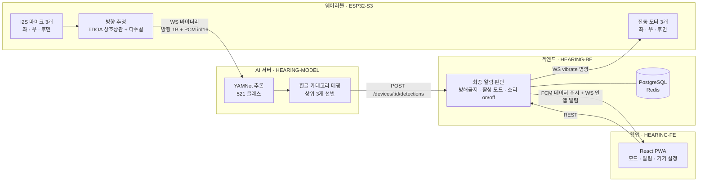
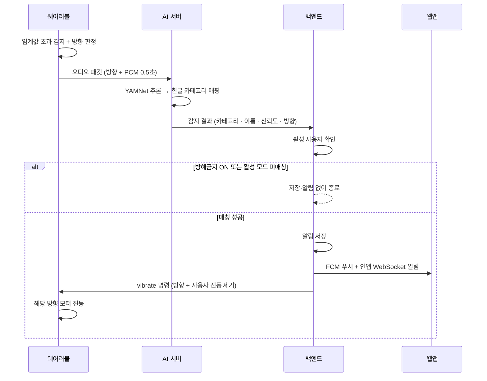

# Hear:ing 
청각장애인을 위한 AI 기반 웨어러블 실시간 소리 알림 서비스

<br />

## **💡1. 프로젝트 개요**

### 1-1. 프로젝트 소개
- 프로젝트 명 : 청각장애인을 위한 AI 기반 웨어러블 실시간 소리 알림 서비스 **Hear:ing**
- 프로젝트 정의 : 넥밴드형 웨어러블이 주변 소리를 듣고, AI가 **무슨 소리인지**를, 하드웨어가 **어디서 나는지**를 판별해, 사용자가 모드별로 골라 둔 소리만 진동과 웹앱 알림으로 전달하는 실시간 소리 알림 서비스

</br>

<br />

### 1-2. 개발 배경 및 필요성

경적·사이렌·화재 경보·초인종처럼 안전과 직결된 정보가 대부분 **소리**로만 전달되기 때문에, 청각장애인은 위험 상황을 인지할 기회 자체를 놓칩니다. 기존 보조기기는 소리 증폭기, 진동 웨어러블, 시각·진동 알림 장치, 소리 인식 앱으로 나뉘지만 **소리의 종류와 방향을 함께 알려주지는 못합니다.** 진동만 울리는 기기는 매번 같은 신호라 상황을 구분할 수 없고, 소리 인식 앱은 하드웨어 피드백과 연동되지 않습니다. </br></br>

저희는 청각장애인 및 보호자를 대상으로 **실생활 안전 보조기기 수요조사(Google Forms)** 를 진행하고, 응답자 중 회신 가능자를 대상으로 **심층 인터뷰**를 통해 기능의 필요성을 검증했습니다. 조사 결과 반복해서 확인된 요구는 세 가지였습니다. </br></br>

> "소리에 대한 방향이 제일 궁금했고, 그게 무슨 소리인지 어디서 나는지를 몰라서 매우 답답했습니다." — 심층 인터뷰 응답 중

- **방향 정보** : "무슨 소리인지"만큼 "어디서 나는지"가 핵심 불편으로 확인 → 좌/우/후방 방향 기반 진동 피드백
- **상황별 설정** : 실외·업무·가정·수면 등 생활 맥락에 따라 필요한 소리가 달라짐 → 모드 기반 소리 필터링
- **간결한 정보** : 긴 설명보다 짧은 알림과 직관적 표시를 선호 → 알림 문구 최소화, 상세는 필요할 때만


<br />

### 1-3. 프로젝트 특장점
- **소리의 종류 + 방향**을 함께 전달 — AI는 종류를, 하드웨어는 방향을 판별해 좌/우/후방 모터로 방향까지 진동으로 알림
- **판단의 주체를 백엔드로 일원화** — AI 서버는 분류만, 최종 알림 여부는 사용자의 활성 모드·소리별 on/off·방해금지 설정으로 백엔드가 결정
- **모드 기반 개인화 필터링** — 실외·수면·업무 등 상황별 모드를 만들고, 8개 카테고리 67종 소리를 모드마다 켜고 끌 수 있음
- **3중 알림 채널** — 웨어러블 진동(즉시) · FCM 푸시(앱이 꺼져 있어도) · 인앱 WebSocket(앱을 보고 있을 때)


<br />

### 1-4. 주요 기능
- **실시간 소리 감지·전송(H/W)** : I2S 마이크 3개로 16kHz PCM을 수집하고, 에너지 임계값을 넘으면 0.5초 단위로 AI 서버에 스트리밍
- **소리 방향 추정(H/W)** : 마이크 쌍별 상호상관 피크(서브샘플 포물선 보간)로 TDOA를 구하고, 1초 창의 다수결 투표로 FRONT/BACK/LEFT/RIGHT 판정
- **방향 진동 피드백(H/W)** : 백엔드의 vibrate 명령을 받아 해당 방향 모터를 구동, 배터리 전압 보정으로 잔량과 무관하게 일정한 세기 유지
- **AI 소리 분류(AI)** : Google YAMNet으로 521개 AudioSet 클래스를 추론하고, 서비스 한글 카테고리(긴급·교통·사람·생활음·자연·동물·주방·음악)로 매핑해 상위 3개 반환
- **최종 알림 판단(BE)** : 감지 결과를 기기의 **활성 사용자**에게 라우팅 → 방해금지 확인 → 활성 모드·소리별 on/off 매칭 → 알림 저장 → 푸시·인앱·진동 팬아웃 (매칭 실패 시 아무것도 남기지 않음)
- **모드 관리(FE/BE)** : 모드 최대 6개, 1개만 활성. 모드별 소리 목록 교체와 개별 소리 on/off 지원
- **알림 이력(FE/BE)** : `(detected_at, id)` 커서 기반 무한 스크롤, 일괄 삭제(멱등), 실시간 수신분과 조회분을 동일 스키마로 통합
- **기기 연결(FE/BE)** : "연결하기" 한 번으로 하드웨어 접속 여부를 즉시 확인(미접속이면 409)하고 활성 사용자를 전환, 기기 이름은 계정별로 따로 저장
- **라이브 사운드(FE/BE)** : 웨어러블 없이도 휴대폰 마이크로 주변 소리를 분석해 감지 결과를 실시간으로 확인
- **로그인/온보딩(FE/BE)** : Google 로그인과 게스트 로그인, 장애 유형·닉네임·약관·기기 연결로 이어지는 온보딩 흐름
- **양방향 소통 화면(FE)** : 대면 상황에서 대화를 주고받는 화면


<br />

### 1-5. 기대 효과 및 활용 분야

기대 효과
> 소리의 **종류와 방향**을 함께 전달해 "무언가 울렸다"에서 "뒤쪽에서 경적이 울렸다"로 정보의 질을 바꿉니다. 필요한 소리만 모드로 걸러내므로 알림 피로 없이 안전과 직결된 소리에 집중할 수 있고, 진동·푸시·인앱 알림을 함께 제공해 기기를 착용하지 않은 순간에도 정보가 끊기지 않습니다. 감지 이력이 쌓이면 사용자가 자주 노출되는 소리 환경을 파악해 모드 구성을 개선할 수 있고, 웹 기반 PWA라 설치 장벽 없이 배포와 업데이트가 가능합니다. 팀 관점에서는 하드웨어–AI–백엔드–프론트를 계약 기반으로 나누어 개발하며 실시간 시스템의 통합 경험을 확보했습니다.

활용 분야
> 보행·외출 시 차량 접근과 경적, 가정에서의 초인종·화재 경보·가전 알림음, 수면 중 긴급 소리 선별 알림 등 일상 안전 영역에 바로 적용할 수 있습니다. 나아가 소음이 큰 산업 현장의 작업자 안전 보조, 고령자·이명 환자 등 청력 저하가 있는 사용자의 생활 보조, 이어폰 착용으로 주변음을 놓치기 쉬운 일반 사용자의 보행 안전 보조로 확장할 수 있으며, 학교·복지관 등에서는 소리 환경 인지 교육 도구로도 활용할 수 있습니다.

<br />

### 1-6. 기술 스택

<table>
  <thead>
    <tr>
      <th>구분</th>
      <th>항목</th>
      <th>상세내용</th>
    </tr>
  </thead>
  <tbody>
    <!-- S/W 개발환경 -->
    <tr>
      <td rowspan="5"><strong>S/W 개발환경</strong></td>
      <td>OS</td>
      <td>Windows 11, macOS</td>
    </tr>
    <tr>
      <td>개발환경(IDE)</td>
      <td>VSCode, PlatformIO IDE</td>
    </tr>
    <tr>
      <td>개발도구</td>
      <td>FastAPI, React, Vite, SQLAlchemy, Alembic, Docker, TensorFlow, YAMNet, Firebase Cloud Messaging</td>
    </tr>
    <tr>
      <td>개발언어</td>
      <td>Python, TypeScript, C++, SQL</td>
    </tr>
    <tr>
      <td>기타사항</td>
      <td>PostgreSQL, Redis, JWT 인증, Google 로그인, AWS 배포 예정</td>
    </tr>
    <!-- H/W 구성장비 -->
    <tr>
      <td rowspan="5"><strong>H/W 구성장비</strong></td>
      <td>디바이스</td>
      <td>ESP32-S3 N16R8 기반 넥밴드</td>
    </tr>
    <tr>
      <td>센서·구동부</td>
      <td>INMP441 마이크 3개, 코인형 진동모터 3개, 상태 표시 LED</td>
    </tr>
    <tr>
      <td>전원부</td>
      <td>LiPo 배터리, TP4056 충전 모듈, S9V11F3S5C3 벅-부스트, 배터리 전압 감지, 전원 스위치</td>
    </tr>
    <tr>
      <td>통신</td>
      <td>Wi-Fi, WebSocket</td>
    </tr>
    <tr>
      <td>기타사항</td>
      <td>16kHz PCM 오디오 스트리밍, TDOA 기반 방향 추정, PWM 진동 제어</td>
    </tr>
    <!-- 프로젝트 관리환경 -->
    <tr>
      <td rowspan="3"><strong>프로젝트 관리환경</strong></td>
      <td>형상관리</td>
      <td>Git, GitHub, PR 리뷰</td>
    </tr>
    <tr>
      <td>의사소통관리</td>
      <td>Discord, 카카오톡, GitHub Issues</td>
    </tr>
    <tr>
      <td>기타사항</td>
      <td>Notion, Figma, Google Forms</td>
    </tr>
  </tbody>
</table>

---

## **💡2. 팀원 소개**

| [](https://github.com/lycheelove) | [](https://github.com/chubin925) | [](https://github.com/chokimilk01) | [](https://github.com/uga001) | [](https://github.com/ysysys03) |
|:---:|:---:|:---:|:---:|:---:|
| [김시연](https://github.com/lycheelove) | [양수빈](https://github.com/chubin925) | [김서현](https://github.com/chokimilk01) | [유선영](https://github.com/uga001) | [최예소](https://github.com/ysysys03) |
| • 팀장 <br> • 프론트엔드 | • 프론트엔드 | • 백엔드 | • 하드웨어 | • AI |

## 🖼️ 단체 사진

<!-- ⬇️ 이미지 자리 2 : 단체 사진 (Notion "깃허브 리드미 작성" 페이지)

-->

---
## **💡3. 시스템 구성도**

### 전체 구조



### 소리 감지 → 알림 흐름



### 하드웨어 구성

| 회로 구성도 |
|---------------|
|  |
| 회로도 |
|  |

<!-- ⬇️ 이미지 자리 : ERD·주요 화면 등 추가할 그림이 있으면 아래 형식으로 넣기
| 엔티티 관계도(ERD) |
|---------------|
|  |
-->

<br />

## **💡4. 작품 소개영상**

<!-- ⬇️ 링크 자리 : 소개 영상 업로드 후 아래 줄의 주석을 풀고 URL 교체
### 🔗[Hear:ing 프로젝트 소개 영상 보러가기](영상-URL)
-->

<br />

## **💡5. 핵심 소스코드**

<details>
  <summary><h3>하드웨어 — 마이크 3개 도달 시간차(TDOA) 기반 방향 추정</h3></summary>

```cpp
// cross-correlation peak 위치 반환(서브샘플 보간). d>0: a가 먼저 도달, d<0: b가 먼저 도달.
static float cross_corr_peak(const int16_t* a, const int16_t* b) {
    constexpr int N = 2 * MAX_TDOA_SAMPLES + 1;
    float corr[N];

    for (int d = -MAX_TDOA_SAMPLES; d <= MAX_TDOA_SAMPLES; d++) {
        float s = 0;
        for (int i = 0; i < BLOCK_SIZE; i++) {
            int j = i + d;
            if (j >= 0 && j < BLOCK_SIZE) s += (float)a[i] * (float)b[j];
        }
        corr[d + MAX_TDOA_SAMPLES] = s;
    }

    // 정수 피크 탐색
    int best_idx = 0;
    for (int k = 1; k < N; k++) {
        if (corr[k] > corr[best_idx]) best_idx = k;
    }

    // 경계에서는 보간 불가 → 정수값 반환
    if (best_idx == 0 || best_idx == N - 1)
        return (float)(best_idx - MAX_TDOA_SAMPLES);

    // 포물선 보간
    float y0 = corr[best_idx - 1];
    float y1 = corr[best_idx];
    float y2 = corr[best_idx + 1];
    float denom = y0 - 2.0f * y1 + y2;
    float offset = (denom != 0.0f) ? 0.5f * (y0 - y2) / denom : 0.0f;

    return (float)(best_idx - MAX_TDOA_SAMPLES) + offset;
}

void direction_update(const int16_t* l, const int16_t* r, const int16_t* b,
                      long energy_l, long energy_r, long energy_b, int frames) {
    // skip되는 블록도 슬롯 자체는 항상 흘려보내야 vote_buf가 실제 경과 시간과 맞음
    Direction vote = Direction::UNKNOWN;

    // frames로 나눠야 트리거 기준과 일치하고, B만 큰 소리(BACK)도 게이트 통과 가능.
    if (frames > 0 && max(energy_l, max(energy_r, energy_b)) / frames >= TRIGGER_THRESHOLD) {
        float tdoa_lr = cross_corr_peak(l, r);
        float tdoa_lb = cross_corr_peak(l, b);
        float tdoa_rb = cross_corr_peak(r, b);

        if (tdoa_lb < -TDOA_THRESHOLD && tdoa_rb < -TDOA_THRESHOLD) {
            vote = Direction::BACK;
        } else if (tdoa_lr < -TDOA_THRESHOLD) {
            vote = Direction::LEFT;
        } else if (tdoa_lr > TDOA_THRESHOLD) {
            vote = Direction::RIGHT;
        } else if (tdoa_lb > TDOA_THRESHOLD && tdoa_rb > TDOA_THRESHOLD) {
            vote = Direction::FRONT;
        }
        // 그 외 애매한 경우는 vote == UNKNOWN 유지 (투표는 안 하지만 슬롯은 소모)
    }

    vote_buf[vote_idx] = vote;
    vote_idx = (vote_idx + 1) % VOTE_BUF_SIZE;
}

// 1초(VOTE_BUF_SIZE) 창의 다수결로 최종 방향 결정
Direction direction_get() {
    int count[4] = {0};
    for (int i = 0; i < VOTE_BUF_SIZE; i++) {
        uint8_t v = (uint8_t)vote_buf[i];
        if (v < 4) count[v]++;
    }
    int best = -1, best_count = 0;
    for (int d = 0; d < 4; d++) {
        if (count[d] > best_count) { best_count = count[d]; best = d; }
    }
    return best >= 0 ? (Direction)best : Direction::UNKNOWN;
}
```
</details>

<details>
  <summary><h3>하드웨어 — 소리 감지 상태머신 & 배터리 보정 진동 제어</h3></summary>

```cpp
enum class State { IDLE, GATHERING, STREAMING };

void detector_process() {
    static State state          = State::IDLE;
    static int   sample_counter = 0;
    static int   silence_counter = 0;
    static long  energy_acc = 0;

    long block_el = 0, block_er = 0, block_eb = 0;
    int  frames = audio_read_block(&block_el, &block_er, &block_eb);
    long block_max = max(block_el, max(block_er, block_eb));

    // 진동 직후 무음 구간: I2S는 계속 드레인하되 트리거/방향투표/전송은 전부 스킵.
    if (audio_is_muted()) return;

    if (state == State::IDLE) {
        if (frames > 0 && block_max / frames > TRIGGER_THRESHOLD) {
            state = State::GATHERING;
            sample_counter = frames;
            energy_acc     = block_max;
            direction_reset();
            int16_t bl[BLOCK_SIZE], br[BLOCK_SIZE], bb[BLOCK_SIZE];
            audio_get_last_block(bl, br, bb);
            direction_update(bl, br, bb, block_el, block_er, block_eb, frames);
        }
        return;
    }

    { // 스트리밍 중에도 매 블록 방향 투표를 이어간다
        int16_t bl[BLOCK_SIZE], br[BLOCK_SIZE], bb[BLOCK_SIZE];
        audio_get_last_block(bl, br, bb);
        direction_update(bl, br, bb, block_el, block_er, block_eb, frames);
    }

    energy_acc += block_max;
    sample_counter += frames;
    if (sample_counter < SEND_INTERVAL_SAMPLES) return;   // 0.5초마다 전송

    Direction dir = direction_get();
    direction_reset();

    int16_t* pcm_buf = ai_ws_get_pcm_buf();
    if (pcm_buf != nullptr) {
        audio_flatten(pcm_buf);
        ai_ws_send(dir, SAMPLE_RATE);   // [방향 1B][패딩 3B][PCM int16]
    }

    long avg_volume = energy_acc / sample_counter;
    if (state == State::GATHERING) state = State::STREAMING;
    sample_counter = 0;
    energy_acc     = 0;

    if (avg_volume < SILENCE_THRESHOLD) {
        if (++silence_counter >= SILENCE_COUNT_MAX) {
            state = State::IDLE;
            silence_counter = 0;
        }
    } else {
        silence_counter = 0;
    }
}

// 모터는 배터리 원 전압(3.0~4.2V)을 그대로 받으므로, 전압 대비 듀티를 보정해
// 실효 전압을 strength% of MOTOR_RATED_VOLTAGE로 고정.
static void write_duty(int pin, uint8_t strength) {
    float battery_v = battery_get_voltage();
    // 비정상적으로 낮으면(ADC 미배선 등) 보정 포기 — 안 그러면 항상 최대 duty로 튐
    if (battery_v < MOTOR_MIN_VALID_BATTERY_V) battery_v = MOTOR_RATED_VOLTAGE;

    float target_v  = (strength / 100.0f) * MOTOR_RATED_VOLTAGE;
    float duty_frac = constrain(target_v / battery_v, 0.0f, 1.0f);
    ledcWrite(pin, (int)(duty_frac * PWM_MAX_DUTY));
}

void motor_vibrate(Direction dir, uint8_t strength) {
    all_off();
    switch (dir) {
        case Direction::LEFT:
            write_duty(MOTOR_PIN_LEFT, strength);
            audio_mute(AUDIO_MUTE_AFTER_VIBRATE_MS);   // 자기 진동음 오탐 방지
            vibrate_until_ms = millis() + VIBRATE_DURATION_MS;
            break;
        case Direction::RIGHT:  /* ... 우측 모터 ... */  break;
        case Direction::BACK:   /* ... 후면 모터 ... */  break;
        case Direction::FRONT:  break;   // Front는 진동 없음
        default:                break;   // 방향 불확실 시 웹앱 알림만
    }
}
```
</details>

<details>
  <summary><h3>AI 서버 — ESP32 오디오 패킷 파싱(방향 헤더 + PCM)</h3></summary>

```python
class Direction(IntEnum):
    FRONT = 0
    BACK = 1
    LEFT = 2
    RIGHT = 3
    UNKNOWN = 4


def parse_audio_packet(packet: bytes) -> tuple[int, str, bytes]:
    """
    ESP32 패킷 구조

    [0]     : 방향 1바이트
    [1:4]   : 패딩 3바이트
    [4:]    : PCM signed int16 little-endian 오디오

    반환값:
        direction_value: 0~4
        direction_name: FRONT/BACK/LEFT/RIGHT/UNKNOWN
        pcm_audio: 헤더가 제거된 순수 PCM 데이터
    """

    if len(packet) < 4:
        raise ValueError(f"패킷 길이가 너무 짧습니다: {len(packet)}바이트")

    raw_direction = packet[0]

    try:
        direction_enum = Direction(raw_direction)
    except ValueError:
        direction_enum = Direction.UNKNOWN   # 잘못된 방향 값은 UNKNOWN 처리

    pcm_audio = packet[4:]

    if not pcm_audio:
        raise ValueError("PCM 오디오 데이터가 없습니다.")

    # int16 샘플은 하나당 2바이트
    if len(pcm_audio) % 2 != 0:
        raise ValueError(f"PCM int16 데이터 길이는 짝수여야 합니다: {len(pcm_audio)}바이트")

    return int(direction_enum.value), DIRECTION_NAMES[direction_enum], pcm_audio
```
</details>

<details>
  <summary><h3>AI 서버 — YAMNet 추론 및 한글 소리 카테고리 매핑</h3></summary>

```python
class AudioClassifier:
    def __init__(self):
        self._model = hub.load(_YAMNET_URL)   # https://tfhub.dev/google/yamnet/1

        class_map_path = self._model.class_map_path().numpy().decode("utf-8")
        self._class_names = [
            row["display_name"] for row in csv.DictReader(open(class_map_path, encoding="utf-8"))
        ]

    def classify(self, audio_bytes: bytes) -> dict | None:
        # PCM int16 → float32 정규화 (YAMNet 입력 규격)
        audio = np.frombuffer(audio_bytes, dtype=np.int16).astype(np.float32) / 32768.0

        max_amp = np.max(np.abs(audio))
        if max_amp > 0:
            audio = audio / max_amp

        scores, _, _ = self._model(audio)
        mean_scores = tf.reduce_mean(scores, axis=0).numpy()

        top_indices = mean_scores.argsort()[-_TOP_K:][::-1]   # 상위 20개 원시 클래스
        block_results = {}

        for idx in top_indices:
            score = float(mean_scores[idx])
            if score < _MIN_SCORE:
                continue

            sound_name = self._class_names[idx]
            category, block = get_category_info(sound_name)   # 영문 라벨 → 한글 (카테고리, 소리)

            if category == "기타" or block == "기타":
                continue   # 서비스 카탈로그에 없는 소리는 버린다

            key = (category, block)
            # 같은 (카테고리, 소리)로 매핑되는 여러 YAMNet 클래스는 최고 점수만 남긴다
            # 예: Vehicle / Car / Motor vehicle (road) → 교통 / 차량 주행음
            if key not in block_results or score > block_results[key]["score"]:
                block_results[key] = {
                    "category": category, "block": block,
                    "sound": sound_name, "score": score,
                }

        results = sorted(block_results.values(), key=lambda x: x["score"], reverse=True)
        results = results[:_RESULT_LIMIT]   # 최종 3개
        if not results:
            return None

        total_score = sum(item["score"] for item in results)
        return {
            "top_sounds": [
                {
                    "category": item["category"],
                    "block": item["block"],
                    "sound": item["sound"],
                    "score": round(item["score"], 4),
                    "percent": round((item["score"] / total_score) * 100, 2),
                }
                for item in results
            ]
        }
```
</details>

<details>
  <summary><h3>백엔드 — 감지 결과 라우팅(활성 사용자 판별)</h3></summary>

```python
"""기기 서비스 — 물리 기기(넥밴드)는 1대뿐이라 DB 행도 1개만 둔다.

알림·진동을 받는 사람은 그 행의 active_user_id 한 명(= 마지막으로 [기기 연결]을
누른 계정)이고, 전환은 오직 connect 에서만 일어난다(로그인은 아무것도 바꾸지 않는다).
기기 이름은 계정별 데이터(users.device_nickname) — 같은 기기를 계정마다 다른 이름으로 부른다.
웨어러블(source='device')과 AI 서버(source='ai-server')의 감지 결과는 모두
POST /devices/:id/detections 로 받는다.
"""

async def handle_detection(
    db: AsyncSession,
    device_id: int,
    payload: DetectionCreate,
    source: str,
) -> None:
    """소리 필터링 흐름 진입점.

    1) JWT source 확인 (caller가 이미 검증, 여기서는 값만 사용)
    2) Device(물리 행) 존재 확인 → active_user 파악
    3) 현재 사용자가 없으면 스킵, 있으면 notification_service 에 위임
    """
    from app.services import notification_service

    device = await get_or_404(db, Device, device_id)
    if device.active_user_id is None:
        logger.info(
            "detection dropped (no active user) device_id=%s sound=%s",
            device_id, payload.sound_name,
        )
        return

    await notification_service.handle_detection(
        db=db,
        user_id=device.active_user_id,
        device=device,
        payload=payload,
        source=source,
    )


async def connect_device(db: AsyncSession, user_id: int, nickname: str | None) -> DeviceResponse:
    """[기기 연결] — 하드웨어가 지금 서버 WS 에 붙어 있는지 즉시 확인하고, 붙어 있으면
    이 계정을 현재 사용자로 전환한다(다른 계정이 쓰던 중이어도 덮어씀 — 합의된 정책).
    폴링 없이 이 응답 하나로 온보딩의 성공/실패가 결정된다."""
    from app.websocket.manager import device_manager
    ...
```
</details>

<details>
  <summary><h3>백엔드 — 최종 알림 판단(방해금지 · 활성 모드 매칭 · 팬아웃)</h3></summary>

```python
async def handle_detection(
    db: AsyncSession,
    user_id: int,
    device: Device,
    payload: DetectionCreate,
    source: str,
) -> Notification | None:
    from app.services import push_service
    from app.websocket import detection_handler, device_handler

    # 방해금지(완전 차단): 켜져 있으면 감지를 통째로 무시한다.
    # 기록(DB)·WS 인앱 알림·FCM 푸시 전부 중단 (앱 푸시 OFF 와 달리 기록도 남기지 않음).
    user = await get_or_404(db, User, user_id)
    if user.do_not_disturb:
        return None

    active_sound_ids = await _get_active_mode_sound_ids(db, user_id)
    if active_sound_ids is None:
        return None   # 활성 모드가 없으면 알리지 않는다

    # AI서버는 sound_id 를 모르고 한글 (category, name)만 보낸다 → 이름으로 sound_id 해석.
    # 웨어러블이 sound_id 를 직접 주면 그대로 사용.
    sound_id = payload.sound_id
    if sound_id is None:
        sound_id = await _resolve_sound_id(db, payload.sound_category, payload.sound_name)

    if sound_id is None or sound_id not in active_sound_ids:
        return None   # 사용자가 끄둔 소리 — 조용히 무시, 아무것도 저장하지 않는다

    notification = Notification(
        user_id=user_id,
        device_id=device.id,
        sound_id=sound_id,
        sound_name=payload.sound_name,
        sound_category=payload.sound_category,
        source=source,
        confidence=payload.confidence,
        detected_at=payload.detected_at,
        is_read=False,
    )
    db.add(notification)
    await db.commit()
    await db.refresh(notification)

    # ① FCM 푸시 — 만료된 토큰은 즉시 정리해 다음 감지부터 헛발송하지 않는다
    if user.push_enabled and user.fcm_token:
        try:
            await push_service.send_detection_push(user.fcm_token, notification)
        except push_service.UnregisteredFcmTokenError:
            await _clear_fcm_token(db, user_id, user.fcm_token)

    # ② 인앱 WebSocket 브로드캐스트 (앱을 보고 있는 경우)
    await detection_handler.broadcast_detection(user_id, notification)

    # ③ 하드웨어 진동 명령 — 기기 WS 가 끊겨 있으면 드롭(진동은 실시간 경보라 큐잉하지 않음)
    await device_handler.send_vibrate(
        mac=device.mac_address,
        strength=user.haptic_strength,
        sound_name=notification.sound_name,
        sound_category=notification.sound_category,
        direction=payload.direction,
    )
    return notification
```
</details>

<details>
  <summary><h3>백엔드 — 하드웨어 WebSocket 채널(연결 상태 · 진동 명령)</h3></summary>

```python
"""하드웨어(ESP32) WS 핸들러. /ws/devices?token={device_token}&mac={MAC}

기기 WS 수명주기가 is_connected 의 진실 원천:
  접속 → is_connected=True, 해제 → False (+ last_seen_at 갱신)
  {"type": "status"} 수신 → battery_level·last_seen_at 갱신
물리 기기 행은 1개뿐이라(단일 행 모델) 갱신은 MAC 으로 그 행을 찾는다.
[기기 연결] 버튼의 즉시 확인은 device_manager.is_connected 가 담당한다.
"""

async def handle_device_socket(ws: WebSocket, mac: str) -> None:
    await device_manager.connect(mac, ws)
    await _set_connected(mac, True)
    try:
        while True:
            raw = await ws.receive_text()
            try:
                message = json.loads(raw)
            except json.JSONDecodeError:
                logger.warning("device ws malformed json mac=%s", mac)
                continue
            if isinstance(message, dict) and message.get("type") == "status":
                await _apply_status(mac, message)   # 배터리 잔량 보고
    except WebSocketDisconnect:
        pass
    finally:
        # 재연결로 교체돼 이미 빠진 연결이면 DB를 건드리지 않는다
        # (새 연결이 True 로 만든 상태를 덮어쓰지 않도록).
        if device_manager.disconnect(mac, ws):
            await _set_connected(mac, False)


async def send_vibrate(
    mac: str,
    strength: int,
    sound_name: str,
    sound_category: str,
    direction: Direction = "UNKNOWN",
) -> bool:
    """notification_service 가 매칭 성공 시 호출. 기기 오프라인이면 드롭+로그.
    진동은 실시간 경보라 큐잉하지 않는다 (웹앱 알림·감지 기록은 호출측에서 이미 진행됨)."""
    sent = await device_manager.send_to_device(mac, {
        "type": "vibrate",
        "strength": strength,
        "sound_name": sound_name,
        "sound_category": sound_category,
        "direction": direction,
    })
    logger.info(
        "vibrate %s mac=%s strength=%s sound=%s",
        "sent" if sent else "dropped (device offline)", mac, strength, sound_name,
    )
    return sent
```
</details>

<details>
  <summary><h3>프론트엔드 — 실시간 감지 알림 WebSocket 훅(토큰 갱신 · 지수 백오프)</h3></summary>

```typescript
// 인증 실패 시 서버가 보내는 close code.
// 단, 핸드셰이크가 거부되면 브라우저는 4401 대신 1006을 주기도 하므로 단독 신호로는 부족하다.
const AUTH_FAILED_CLOSE_CODE = 4401;
// 재연결 백오프: 첫 1초에서 시작해 2배씩 늘리고 상한 30초.
const INITIAL_RECONNECT_DELAY = 1000;
const MAX_RECONNECT_DELAY = 30000;
// 한 번도 연결에 성공하지 못한 채(onopen 없이) 닫히는 상황의 연속 재시도 상한.
const MAX_INITIAL_CONNECT_ATTEMPTS = 5;
const MAX_AUTH_REFRESH_ATTEMPTS = 2;

// 실시간 소리 감지 알림을 받는 WebSocket을 연결하는 훅.
// 토큰이 있을 때만 연결하고, detection 메시지를 받으면 onDetection 콜백으로 넘긴다.
// 비정상 종료 시 지수 백오프로 재연결하되, 연결조차 못 한 반복 거부(상한 초과)는
// 재연결하지 않아 잘못된 토큰으로 서버를 무한히 두드리지 않는다.
export const useDetectionSocket = ({ token, onDetection }: UseDetectionSocketParamsTypes) => {
  const onDetectionRef = useRef(onDetection);
  useEffect(() => {
    onDetectionRef.current = onDetection;
  });

  useEffect(() => {
    if (!token) return;   // 로그인 전에는 연결하지 않는다

    let socket: WebSocket | null = null;
    let reconnectDelay = INITIAL_RECONNECT_DELAY;
    let isUnmounted = false;
    let hasConnected = false;
    let initialConnectAttempts = 0;
    let authRefreshAttempts = 0;

    const getValidToken = async (): Promise<string | null> => {
      const storedToken = getAccessToken();
      if (!storedToken) return null;
      if (!isTokenExpired(storedToken)) return storedToken;
      return refreshAccessToken();   // 만료됐으면 조용히 재발급
    };

    const connect = async () => {
      const validToken = await getValidToken();
      if (isUnmounted || !validToken) return;

      // 토큰에 쿼리스트링 예약 문자(+, /, = 등)가 있어도 깨지지 않도록 인코딩한다.
      const encodedToken = encodeURIComponent(validToken);
      socket = new WebSocket(`${getWebSocketBaseUrl()}/ws/users/me/detections?token=${encodedToken}`);

      socket.onopen = () => {
        hasConnected = true;
        reconnectDelay = INITIAL_RECONNECT_DELAY;
        initialConnectAttempts = 0;
        authRefreshAttempts = 0;
      };

      socket.onmessage = (event) => {
        const message = JSON.parse(event.data) as DetectionMessageTypes;
        if (message.type === 'detection') onDetectionRef.current(message.data);
      };

      socket.onclose = (event) => {
        if (isUnmounted) return;

        if (event.code === AUTH_FAILED_CLOSE_CODE) {
          authRefreshAttempts += 1;
          if (authRefreshAttempts > MAX_AUTH_REFRESH_ATTEMPTS) return;   // 재로그인 필요
          setTimeout(connect, INITIAL_RECONNECT_DELAY);
          return;
        }

        // 한 번도 연결에 성공하지 못한 채(onopen 미발생) 닫혔다면 핸드셰이크 거부로 본다.
        // 브라우저가 4401 대신 1006을 주는 경우라, 상한까지만 시도하고 멈춘다.
        if (!hasConnected && ++initialConnectAttempts >= MAX_INITIAL_CONNECT_ATTEMPTS) return;

        setTimeout(connect, reconnectDelay);
        reconnectDelay = Math.min(reconnectDelay * 2, MAX_RECONNECT_DELAY);
      };
    };

    connect();
    return () => {
      isUnmounted = true;
      socket?.close(NORMAL_CLOSE_CODE);
    };
    // token이 바뀌면(로그인/로그아웃) 기존 연결을 정리하고 새 토큰으로 다시 연결한다.
  }, [token]);
};
```
</details>

<br />

## **💡6. 레포지토리 구성**

| 레포지토리 | 역할 |
|---|---|
| [HEARING-HW](https://github.com/2026-DSWU-Hearing/HEARING-HW) | ESP32-S3 넥밴드 펌웨어 — 소리 감지, 방향 추정(TDOA), 오디오 스트리밍, 진동·배터리·LED 제어 |
| [HEARING-MODEL](https://github.com/2026-DSWU-Hearing/HEARING-MODEL) | AI 서버 — 오디오 패킷 파싱, YAMNet 추론, 한글 소리 카테고리 매핑, 감지 결과 전달 |
| [HEARING-BE](https://github.com/2026-DSWU-Hearing/HEARING-BE) | 백엔드 — 인증, 사용자·모드·기기 관리, 최종 알림 판단, 알림 저장·푸시·진동 명령 |
| [HEARING-FE](https://github.com/2026-DSWU-Hearing/HEARING-FE) | 웹앱(React PWA) — 모드·소리 필터링, 실시간 알림, 알림 이력, 기기 연결, 라이브 사운드 |
